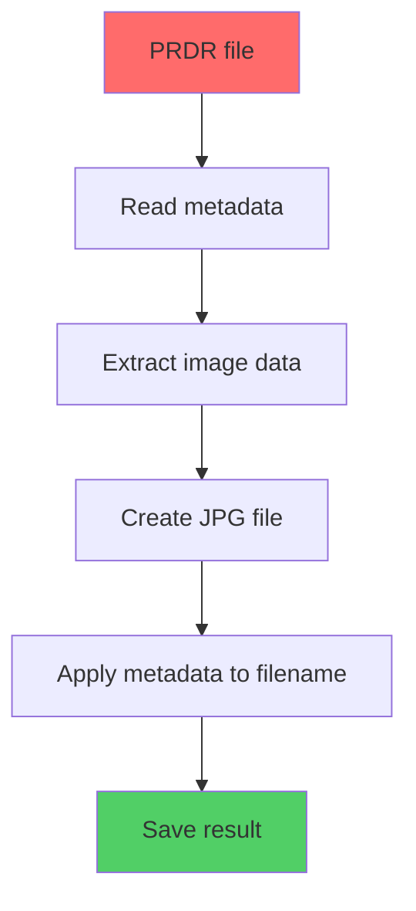

# 📸 RDR2 Photo Converter Tool

<div align="center">


**Elegant tool for converting PRDR photos from Red Dead Redemption 2 to standard JPG images**

[Download](#-installation) • [Usage](#-how-to-use) • [Languages](#-supported-languages) • [FAQ](#-frequently-asked-questions)

</div>

---

## 🌟 Features

<table>
<tr>
<td width="50%">

### ✨ **Core Functionality**
- 🎯 **Automatic conversion** PRDR → JPG
- 📅 **Metadata extraction** (date, time creation)
- 💾 **Smart backup creation**
- 🗑️ **Optional deletion** of source files
- 📁 **Auto-detection** of RDR2 directory

</td>
<td width="50%">

### 🎨 **User Interface**
- 🌍 **6 interface languages**
- 🎭 **Modern Material Design**
- 🖱️ **Intuitive controls**
- 📱 **Adaptive typography**
- 🎪 **Gradient design**

</td>
</tr>
</table>

---

## 🚀 Quick Start

### 📋 Requirements

- **Java 11+** ☕
- **Windows/macOS/Linux** 🖥️
- **Red Dead Redemption 2** (PC version) 🤠

### 📦 Installation

1. **Clone the repository:**
   ```bash
   git clone https://github.com/megaomegapepe/rdr2-photo-converter.git
   cd rdr2-photo-converter
   ```

2. **Build the project:**
   ```bash
   # Gradle
   ./gradlew build
   
   # Maven
   mvn clean compile
   ```

3. **Run the application:**
   ```bash
   # Gradle
   ./gradlew run
   
   # Maven
   mvn exec:java -Dexec.mainClass="RDR2PhotoConverterKt"
   
   # Or directly from JAR
   java -jar build/libs/rdr2-photo-converter.jar
   ```

---

## 🎮 How to Use

### 1️⃣ **Launch the Application**

After startup, you'll see an elegant interface with a gradient background:

<div align="center">

</div>

### 2️⃣ **Select Directory**

**Automatic Detection:**
- Click **"Default Path"** - the application will find the RDR2 folder automatically
- Path: `Documents/Rockstar Games/Red Dead Redemption 2/Profiles/[YOUR_PROFILE]/`

**Manual Selection:**
- Click **"Browse..."** and select the folder containing PRDR files

### 3️⃣ **Configure Options**

<table>
<tr>
<td width="50%">

#### 💾 **Create Backup**
✅ Recommended for safety<br>
📁 Saved to: `Pictures/RDR2 Photos/prdr backups/`

</td>
<td width="50%">

#### 🗑️ **Delete Original Files**
⚠️ Use with caution<br>
💡 Removes PRDR files after conversion

</td>
</tr>
</table>

### 4️⃣ **Conversion**

Click **🚀 Convert Files** and watch the process:

```
Status: Found 15 PRDR files, ready for conversion
🔄 Converting...
✅ Conversion completed successfully! 15 files converted
```

---

## 📁 Where to Find Results

### 📸 **Converted Images**
```
📂 Pictures/
  └── 📂 RDR2 Photos/
      ├── 🖼️ 2024-01-15 14.32.45 PRDR0001.jpg
      ├── 🖼️ 2024-01-15 14.35.22 PRDR0002.jpg
      └── 📂 prdr backups/
          ├── 📄 2024-01-15 14.32.45 PRDR0001
          └── 📄 2024-01-15 14.35.22 PRDR0002
```

### 🏷️ **File Naming Format**
```
YYYY-MM-DD HH.MM.SS ORIGINAL_NAME.jpg
```

**Example:** `2024-01-15 14.32.45 PRDR0001.jpg`

---

## 🌍 Supported Languages

<div align="center">

| Language | Code | Status | Font |
|----------|------|--------|------|
| 🇺🇸 English | `en` | ✅ Full support | Segoe UI |
| 🇷🇺 Русский | `ru` | ✅ Full support | Segoe UI |
| 🇨🇳 中文 | `zh` | ✅ Full support | Microsoft YaHei |
| 🇩🇪 Deutsch | `de` | ✅ Full support | Segoe UI |
| 🇮🇹 Italiano | `it` | ✅ Full support | Segoe UI |
| 🇪🇸 Español | `es` | ✅ Full support | Segoe UI |

</div>

### 🛠️ **Adding a New Language**

1. Edit `src/main/resources/localization.json`
2. Add a new language to the `languages` section
3. Add translations to the `translations` section
4. Restart the application

```json
{
  "languages": {
    "fr": {
      "code": "fr",
      "displayName": "Français",
      "fontFamily": "Segoe UI"
    }
  },
  "translations": {
    "fr": {
      "app_title": "Outil de Conversion Photo RDR2",
      "window_title": "RDR2 Photo Tool"
    }
  }
}
```

---

## 🔧 Technical Details

### 🏗️ **Architecture**

```
RDR2 Photo Converter
├── 🎨 Modern UI Components
│   ├── ModernButton (gradient buttons)
│   ├── ModernTextField (rounded input fields)
│   ├── ModernCheckBox (custom checkboxes)
│   └── GradientPanel (gradient background)
├── 🌍 Localization System
│   ├── JSON-based configuration
│   ├── Smart font system
│   └── Automatic fallback
└── 📸 Conversion Engine
    ├── Metadata extraction
    ├── PRDR file processing
    └── JPG image creation
```

### 📊 **Conversion Process**



### 🔍 **Dependencies**

Add to your `build.gradle.kts` or `pom.xml`:

**Gradle:**
```kotlin
dependencies {
    implementation("com.fasterxml.jackson.core:jackson-databind:2.15.2")
    implementation("com.fasterxml.jackson.module:jackson-module-kotlin:2.15.2")
}
```

**Maven:**
```xml
<dependency>
    <groupId>com.fasterxml.jackson.core</groupId>
    <artifactId>jackson-databind</artifactId>
    <version>2.15.2</version>
</dependency>
<dependency>
    <groupId>com.fasterxml.jackson.module</groupId>
    <artifactId>jackson-module-kotlin</artifactId>
    <version>2.15.2</version>
</dependency>
```

---

## ❓ Frequently Asked Questions

<details>
<summary><strong>❓ Where does RDR2 store photos?</strong></summary>

**Windows:**
```
C:\Users\[USERNAME]\Documents\Rockstar Games\Red Dead Redemption 2\Profiles\[PROFILE_ID]\
```

**Note:** The application will find this folder automatically!
</details>

<details>
<summary><strong>❓ What are PRDR files?</strong></summary>

PRDR is Rockstar Games' proprietary format for storing screenshots from RDR2. These files contain:
- 📸 Image data in JPG format (starting from byte 300)
- 📅 Metadata: date and time of creation
- 🎮 Game session information
</details>

<details>
<summary><strong>❓ Is it safe to delete PRDR files?</strong></summary>

⚠️ **Caution!** Deleting PRDR files will make them disappear from the RDR2 gallery.

💡 **Recommendation:** Always create a backup before deletion!
</details>

<details>
<summary><strong>❓ The application doesn't display Chinese characters</strong></summary>

Make sure one of the supported fonts is installed on your system:
- Microsoft YaHei (Windows)
- PingFang SC (macOS)
- Source Han Sans (Linux)

The application will automatically select a suitable font or use the system fallback.
</details>

<details>
<summary><strong>❓ How to change the interface language?</strong></summary>

1. Select a language from the dropdown in the top-right corner
2. The interface will update instantly
3. The setting is saved for the current session
</details>

<details>
<summary><strong>❓ Conversion failed - what to do?</strong></summary>

Common solutions:
- ✅ Check if the directory contains PRDR files
- ✅ Ensure you have write permissions to the Pictures folder
- ✅ Verify that PRDR files are not corrupted (size > 300 bytes)
- ✅ Try running the application as administrator

If the problem persists, create an [Issue](https://github.com/your-username/rdr2-photo-converter/issues) with details.
</details>

---

## 🎯 Performance & Optimization

### ⚡ **Speed Benchmarks**
- **Small files** (<1MB): ~10ms per file
- **Large files** (>5MB): ~50ms per file
- **Batch processing**: 100+ files in seconds

### 💾 **Memory Usage**
- **Base application**: ~50MB RAM
- **Per file processing**: +2-5MB (temporary)
- **Large batches**: Auto-cleanup after each file

### 🔒 **Security Features**
- ✅ No network connections required
- ✅ Local file processing only
- ✅ Safe metadata extraction
- ✅ Backup verification

---

## 🤝 Contributing

We welcome community contributions!

### 🎯 **How to Help:**
- 🐛 Report bugs via [Issues](https://github.com/your-username/rdr2-photo-converter/issues)
- 🌍 Add translations for new languages
- 💡 Suggest new features
- 🔧 Create Pull Requests

### 📝 **Contribution Guidelines:**
1. Fork the repository
2. Create a feature branch (`git checkout -b feature/amazing-feature`)
3. Commit your changes (`git commit -m 'Add amazing feature'`)
4. Push to the branch (`git push origin feature/amazing-feature`)
5. Create a Pull Request

### 🌟 **Code Standards:**
- Follow Kotlin coding conventions
- Add documentation for new features
- Include unit tests where applicable
- Maintain consistent UI/UX patterns

---

## 🗓️ Roadmap

### 🔮 **Upcoming Features**
- [ ] **Batch metadata editing**
- [ ] **Custom output formats** (PNG, WEBP)
- [ ] **Image quality settings**
- [ ] **Dark/Light theme toggle**
- [ ] **Drag & drop support**
- [ ] **Progress bar for large batches**
- [ ] **Command-line interface**
- [ ] **Auto-watch folder mode**

### 🎨 **UI Improvements**
- [ ] **Animation effects**
- [ ] **Better responsive design**
- [ ] **Accessibility features**
- [ ] **Keyboard shortcuts**

---

## 📊 Statistics

<div align="center">


</div>

---

## 📜 License

This project is licensed under the MIT License. See the `LICENSE` file for details.

---

## 🙏 Acknowledgments

- 🎮 **Rockstar Games** - for creating the amazing RDR2 game
- 🎨 **Material Design** - for design inspiration
- 🌍 **Translation Community** - for localization help
- ☕ **Jackson Library** - for excellent JSON handling
- 🖼️ **Java Swing** - for the UI framework
- 💎 **Kotlin** - for the beautiful syntax

---

## 📞 Support

Need help? Here are your options:

- 📖 **Documentation**: Check this README first
- 🐛 **Bug Reports**: [GitHub Issues](https://github.com/megaomegapepe/rdr2-photo-converter/issues)
- 💬 **Discussions**: [GitHub Discussions](https://github.com/megaomegapepe/rdr2-photo-converter/discussions)
- 📧 **Email**: mr.safik322@gmail.com

---

<div align="center">

**🤠 Happy hunting for perfect shots in RDR2! 📸**


---

⭐ **If this project helped you, please give it a star!** ⭐

</div>